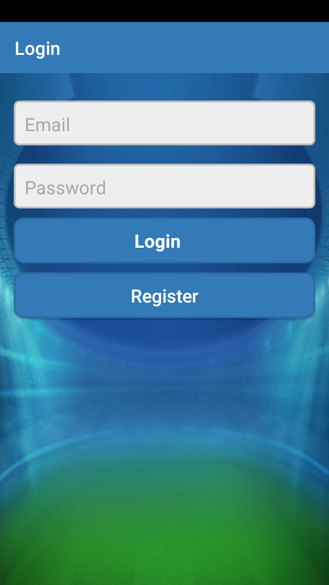
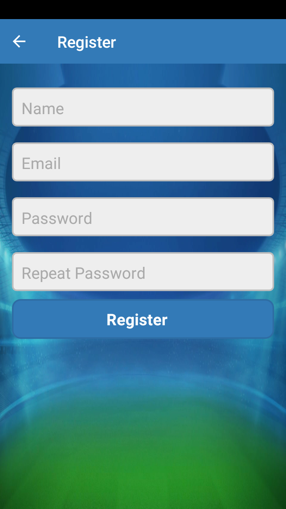
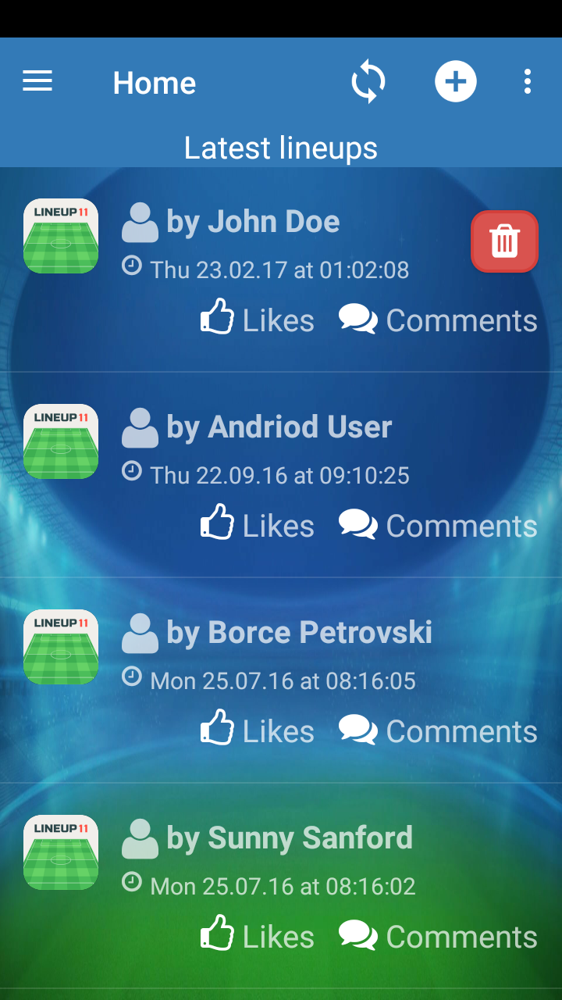
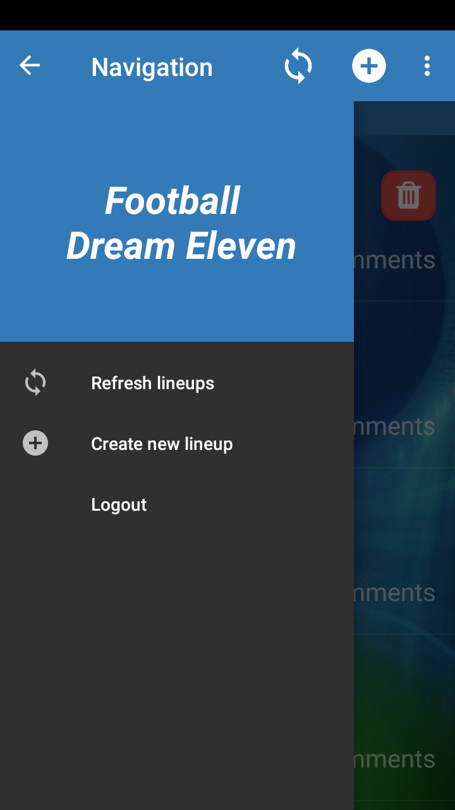
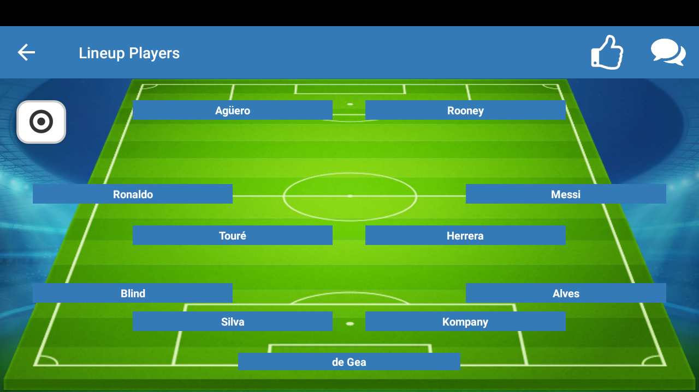
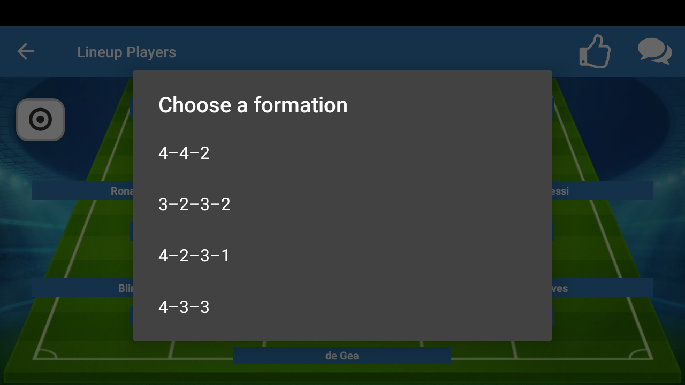
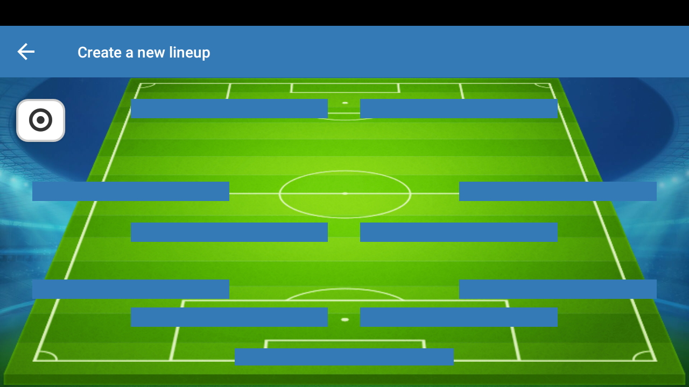
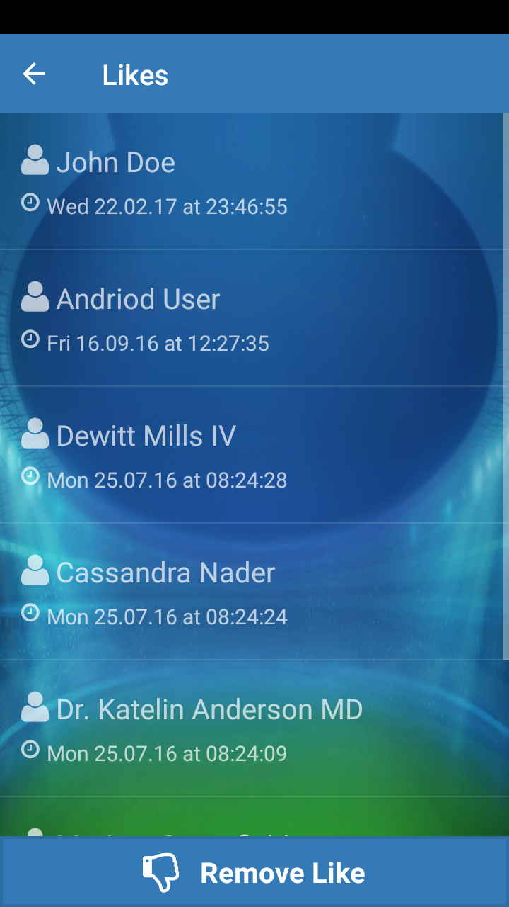
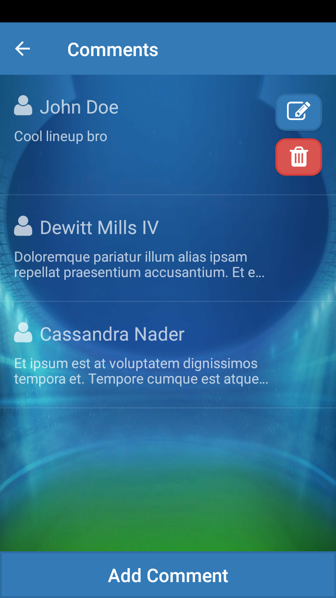
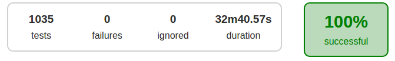

# Football Dream Team

Android application that enables making football dream team. User that want to use the application need to create a account which is free of charge. User can build their own lineups, and also like and comment on other users lienups.

### Extra technologies used:
---
* Retrofit 2 for making REST calls simpler
* Dagger 2 for DI
* Robolectric 3 for Unit testing the app

### To be implemented:
---
- [x] User registration
- [x] User authentication using JWT tokens
- [x] Loading teams, positions and players data and saving it into local SQLite database on first launch
- [x] Listing latest lineups
- [x] Displaying lineup likes
- [x] Adding and removing likes to the lineups
- [x] Displaying lineup comments
- [x] Adding, updating and removing comments to the lineup
- [x] Displaying lineup players
- [x] Updating lineup players
- [x] Creating new lineup
- [x] Deleting existing lineup
- [x] Background service to load and notify the user about the latest likes and comments on his latest lineup

### Screenshots
---

### Test Report
---

### Collaborating:
---
- Borche Petrovski as Android Developer [**@bohap**](https://github.com/bohap)
- Martin Josifovski as Android Developer [**@JosifovskiM**](https://github.com/JosifovskiM)